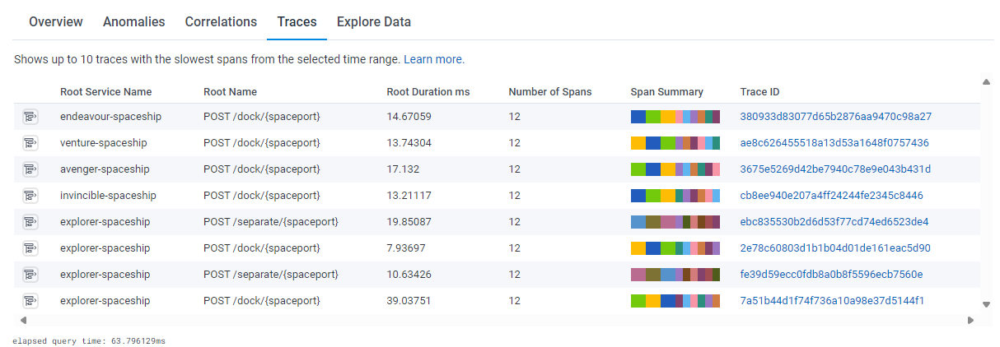
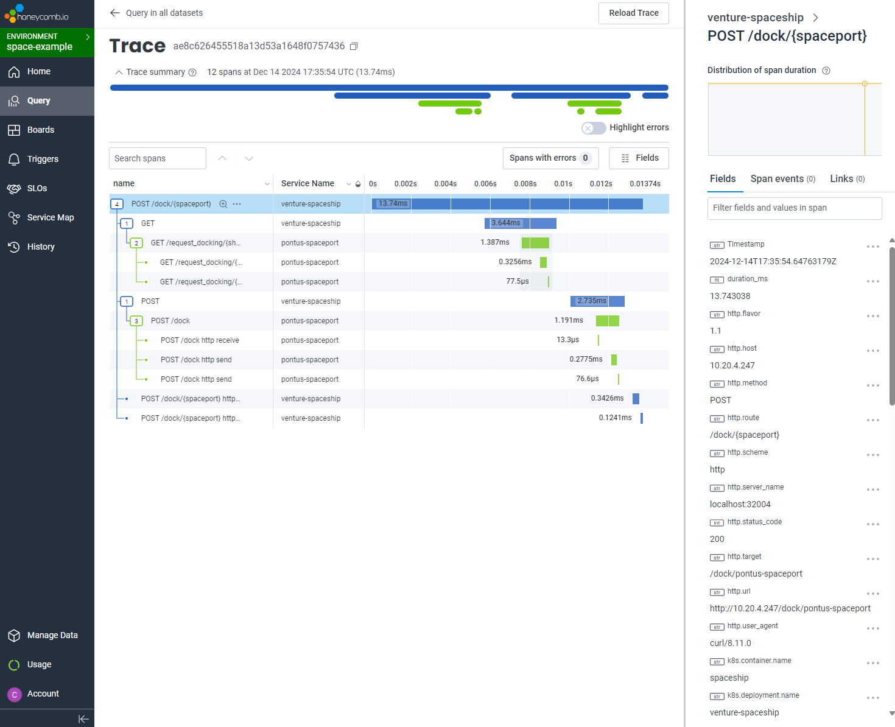
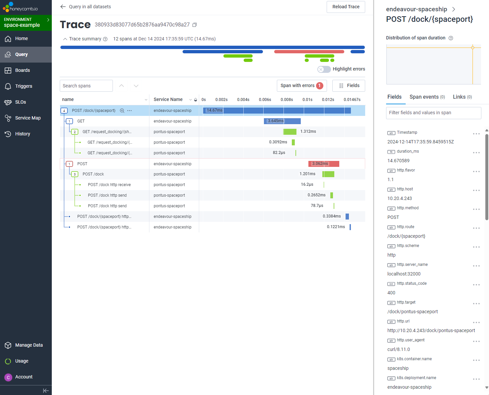

# V2 - Starting to Trace

## Introduction
The SOS were grateful to now have insight into the spaceport's activity. However, trying to piece together information from
the spaceport and spaceship logs was difficult. It was not clear which event in the spaceport logs was related to which event
in the spaceship logs.

They found it difficult to understand the journey of a spaceship requesting authorisation to docker or separate, then 
performing the action. The GIT decided to add tracing to the SOS to help them understand the journey of a spaceship.

In V2 the SOS enables auto-instrumentation using the OTEL Operator. The core services are still the same, but now they are
instrumented to provide traces. The GIT can now see the journey of a spaceship from requesting authorisation to docking or
separating from the spaceport.

## Deploying OpenTelemetry Instrumentation
We will use the opentelemetry operator and install it via helm with a self-signed certificate. You can read more about 
this in the [otel README.md](../otel/README.md).

Once installed deploy the OpenTelemetry Collector and Instrumentation.

```shell
kubectl apply -f otel/v2/
```

## Redeploying the Services
In order for our services to be auto-instrumented we need them to be started after the OTEL config has been deployed. 
Since there is no change to our actual services or the helm charts we can just delete the existing pods and let the
deployment controller recreate them.

```shell
kubectl delete pods -l "space.observation.system/type"
```

After restarting you should be able to see the opentelemetry auto instrumentation container starting in the pod with your
service. For example in the pontus pod

```shell
 kubectl describe pod -l app.kubernetes.io/instance=pontus
 ...
 ...
 Events:
  Type    Reason     Age    From               Message
  ----    ------     ----   ----               -------
  Normal  Scheduled  2m33s  default-scheduler  Successfully assigned default/pontus-spaceport-85cbfcc54f-7dmbh to docker-desktop
  Normal  Pulled     2m30s  kubelet            Container image "ghcr.io/open-telemetry/opentelemetry-operator/autoinstrumentation-python:0.48b0" already present on machine
  Normal  Created    2m29s  kubelet            Created container opentelemetry-auto-instrumentation-python
  Normal  Started    2m29s  kubelet            Started container opentelemetry-auto-instrumentation-python
  Normal  Pulled     2m19s  kubelet            Container image "spaceport:v2" already present on machine
  Normal  Created    2m18s  kubelet            Created container spaceport
  Normal  Started    2m18s  kubelet            Started container spaceport
```

## Testing
We can test this with curl like we did in v1. 

### Dock
```shell
curl -X 'POST' \
  'http://localhost:32001/dock/pontus-spaceport' \
  -H 'accept: application/json' \
  -d ''
```

### Separate
```shell
curl -X 'POST' \
  'http://localhost:32001/separate/pontus-spaceport' \
  -H 'accept: application/json' \
  -d ''
```

## Conclusion
GIT was excited to see the traces in the backend. They could now see the journey of a spaceship from requesting authorisation
to docking or separating from the spaceport. They could see the journey of a spaceship in the backend and could now understand
why things went wrong.

They also had a better understanding of timing and how events correlated with each other as a single trace without all 
the manual work of joining up the log lines. However when things went wrong it was still difficult to understand why just
from the trace.

However even the logs were being intrumented to the operations team could narrow done the relavant log events.

### Example Log - Filtered with traceID
```shell
$ k logs pontus-spaceport-85cbfcc54f-nn9xd spaceport | grep 380933d83077d65b2876aa9470c98a27
{"message": "Requesting docking for ship endeavour-spaceship-8475997dcd-2jl9b", "otelSpanID": "f14bbacbbc8c043c", "otelTraceID": "380933d83077d65b2876aa9470c98a27", "otelTraceSampled": true, "otelServiceName": "pontus-spaceport"}
{"message": "10.20.4.243:40854 - \"GET /request_docking/endeavour-spaceship-8475997dcd-2jl9b HTTP/1.1\" 200", "otelSpanID": "b68a88396a22da4d", "otelTraceID": "380933d83077d65b2876aa9470c98a27", "otelTraceSampled": true, "otelServiceName": "pontus-spaceport"}
{"message": "Docking limit '3' reached, Dock is full", "otelSpanID": "7c8bfa42de6ec394", "otelTraceID": "380933d83077d65b2876aa9470c98a27", "otelTraceSampled": true, "otelServiceName": "pontus-spaceport", "ship_id": "endeavour-spaceship-8475997dcd-2jl9b"}
{"message": "10.20.4.243:40862 - \"POST /dock HTTP/1.1\" 400", "otelSpanID": "0017fa6f91ac76bd", "otelTraceID": "380933d83077d65b2876aa9470c98a27", "otelTraceSampled": true, "otelServiceName": "pontus-spaceport"}
```

### Example Traces

**Traces**


